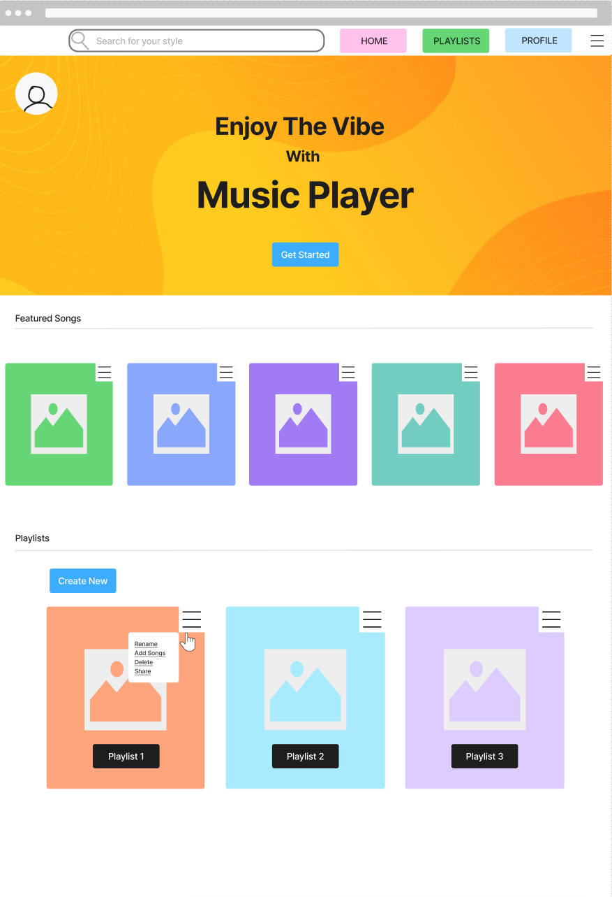

# Milestone 1 – Project Proposal and Design Document

- **Course:** CST-391 Web Application Development
- **Instructor** Professor James Sparks
- **Author:** Carter Wright
- **Date:** January 18, 2026

## Feature Proposal

The proposed feature for the music application is a **Playlist Management system**. This feature allows customers to create, manage, and organize playlists made up of songs in the application. Playlists enhance the user experience by giving customers a personalized way to group and revisit their favorite music.

Role-Based Access Control (RBAC) will differentiate how customers and admins interact with this feature. Customers can create and manage their own playlists, while admins can view all playlists across the system and remove inappropriate or duplicate content. This separation of privileges ensures proper moderation while maintaining user freedom.

----

## User Stories

- **As a customer**, I want to create playlists so that I can organize my favorite songs.
- **As a customer**, I want to add or remove songs from my playlists so that I can customize my listening experience.
- **As an admin**, I want to view all user-created playlists so that I can monitor and moderate content when necessary.
- **As an admin**, I want to delete playlists that violate content rules so that the platform remains appropriate for all users.

----

## Data Model and Design

To support playlists, the following data entities are required:

### Playlist
- id (primary key, UUID)
- name (string, max 100, required)
- userId (foreign key referencing User, required)
- createdAt (datetime, required)

### PlaylistSong (junction table)
- playlistId (foreign key, required)
- songId (foreign key, required)

### Constraints and Indexes
- Playlist userId indexed for fast lookup by owner
- PlaylistSong composite primary key (playlistId, songId) to prevent duplicates
- PlaylistSong playlistId indexed for playlist lookups

### Relationships
- One user can have many playlists
- One playlist can contain many songs
- Songs can belong to multiple playlists

This design supports efficient querying and enforces ownership of playlists by users.

----

## API Design

The following REST API endpoints are required:

### User Endpoints
- **POST /api/playlists**  
  Creates a new playlist (authenticated User)  
  Request body: `{ "name": "Chill Mix" }`  
  Response: `201 Created` with `{ "id": "uuid", "name": "...", "userId": "...", "createdAt": "..." }`

- **GET /api/playlists**  
  Returns playlists owned by the logged-in User  
  Response: `200 OK` with `[ { "id": "uuid", "name": "...", "songCount": 12 } ]`

- **POST /api/playlists/{id}/songs**  
  Adds a song to a playlist (playlist owner only)  
  Request body: `{ "songId": "uuid" }`  
  Response: `201 Created` with `{ "playlistId": "...", "songId": "..." }`

- **DELETE /api/playlists/{id}/songs/{songId}**  
  Removes a song from a playlist (playlist owner only)  
  Response: `204 No Content`

### Admin Endpoints
- **GET /api/admin/playlists**  
  Returns all playlists in the system (admin only)  
  Response: `200 OK` with `[ { "id": "...", "name": "...", "userId": "...", "songCount": 12 } ]`

- **DELETE /api/admin/playlists/{id}**  
  Deletes any playlist (admin only)  
  Response: `204 No Content`

All endpoints require authentication. Admin routes are restricted by role.
Common error responses: `401 Unauthorized`, `403 Forbidden`, `404 Not Found`.

----

## UI and UX Design

### Users Pages
- **/playlists**  
  Displays the User's playlists
- **/playlists/create**  
  Allows Users to create a new playlist
- **/playlists/{id}**  
  Manage songs within a playlist

### Admin Pages
- **/admin/playlists**  
  Displays all playlists across the platform with moderation options

Wireframes will show a simple list-based UI for playlists and a management table for admins.

### Role Access Summary
- **User:** /playlists, /playlists/create, /playlists/{id}
- **Admin:** /admin/playlists (admin-only moderation view)

----

## Security and Route Protection

RBAC will be enforced using role checks within Next.js middleware and protected API routes.

- Users must be authenticated to access playlist pages
- Users can only modify their own playlists
- Admin-only routes require the `admin` role
- Only admins can delete playlists created by other users

This role-based approach simplifies permission management by assigning privileges to roles rather than individual users.

### Permissions Matrix
- **User:** create playlist, view own playlists, add/remove songs in own playlists
- **Admin:** view all playlists, delete any playlist, view moderation data

----

## Assumptions and Constraints

- Authentication and role information are already implemented based on course tutorials
- Only two roles exist: admin and user
- Playlist sharing is not included in this milestone
- Performance optimizations are deferred until later milestones

----

## References

- Course tutorials and lecture materials  
- ChatGPT (2026/01/15). Prompt: “Design a markdown doc I can use for a project proposal.”  
  Response: “A project proposal should include a feature summary, user stories, data model, API, UI, security, and references.”  
- Role-Based Access Control concepts referenced from NIST documentation
